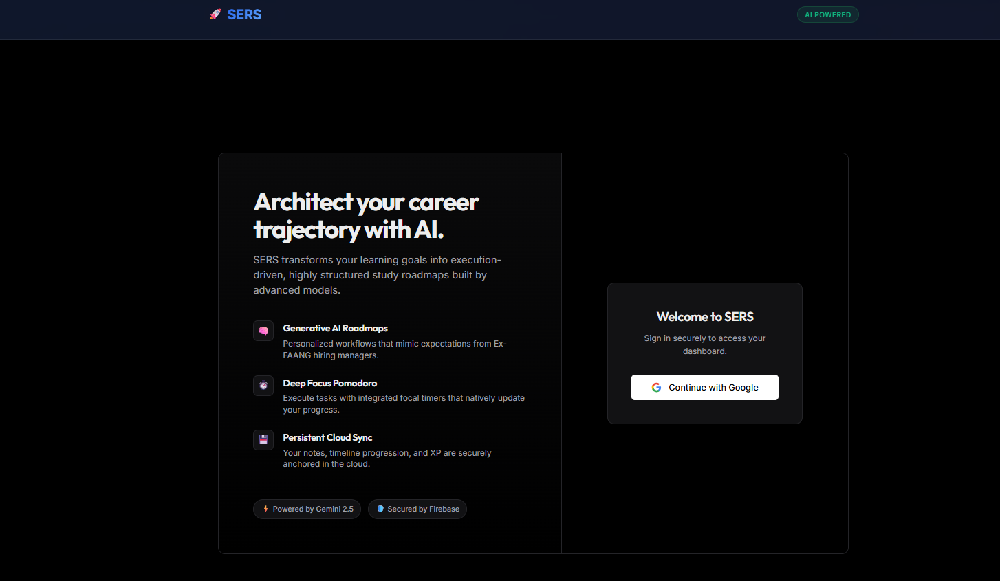
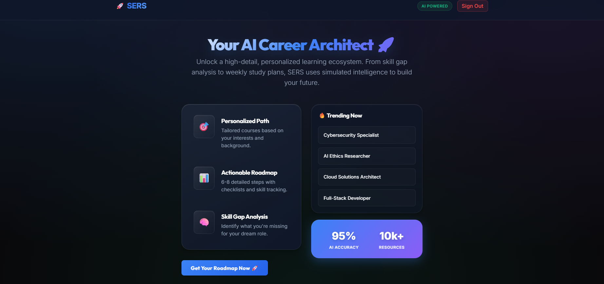
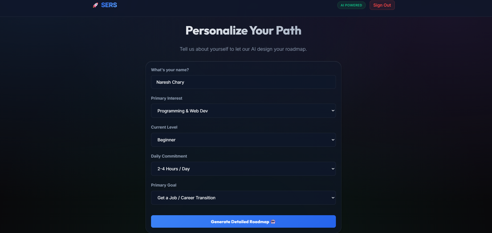
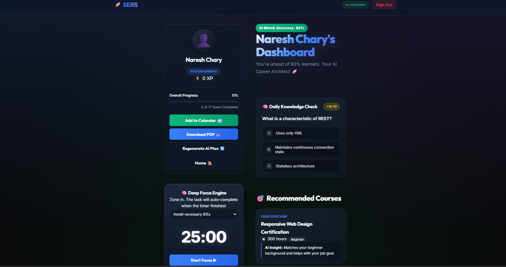

<div align="center">
  <h1>🧠 SERS: Smart E-Learning Recommendation System</h1>
  <p><i>An AI-driven, highly gamified Enterprise Learning Management System built for extreme focus and retention.</i></p>
  
  <p>
    
    
    
    
  </p>
</div>

---

## 🌟 The Vision

**SERS** (Smart E-Learning Recommendation System) is not your average checklist app. It is a fully responsive, enterprise-grade Learning Management System designed around actual behavioral psychology. 

Typical learning platforms fail because users drop off. **SERS** solves the retention problem by wrapping an artificially intelligent study plan inside an exquisitely designed, professional environment featuring GitHub-style consistency matching, deep-focus Pomodoro physics, and dynamic knowledge validation powered by Google's Gemini 2.5 Flash AI model.

## ✨ Core Features

*   **🤖 Gemini AI Study Architect**: Enter any niche goal and current skill level. SERS interfaces with the Gemini 2.5 Flash model (acting as an "Ex-FAANG Hiring Manager") to dynamically generate a brutally realistic, modular study curriculum. No static data. 
*   **💼 Enterprise UI Layout**: A completely overhauled, distraction-free Single-Column Document layout (reminiscent of Vercel or Stripe) ensures extreme readability, featuring deep obsidian dark modes and precise typographic scaling.
*   **🔥 GitHub-Style Activity Heatmap**: Tracks your daily learning streaks. Every complete Pomodoro block or aced quiz instantly lights up your 30-day consistency grid!
*   **⏱️ Deep Focus Pomodoro Engine**: Integrated flawlessly within the linear roadmap flow. Select a generated AI task, start a 25-minute loop, and the app mathematically crosses off your task when finished.
*   **🗂️ Cloud-Synced Developer Scratchpad**: A beautifully clean Markdown-esque IDE. Type your notes directly in the browser—SERS watches your keystrokes and silently auto-saves payloads to Firebase every 1.5 seconds.
*   **🎮 Generated Knowledge Quizzes**: Interactive quizzes generated in real-time by the AI specifically mapped to your customized roadmap track.
*   **☁️ Leapfrog Cloud Auth**: Fully powered by Google Firebase. Secure split-screen authentication landing page. The moment you log in via Google, the application bypasses form states and dynamically hydrates your personalized dashboard using your profile avatar.

## 📸 Interface Sneak Peek

<div align="center">
  <details open>
    <summary><code>1. Split-Screen Authentication (Signup/Login)</code></summary>
    <br>
    
    <p><i>The secure Google Firebase authentication landing page.</i></p>
  </details>
  <br>

  <details open>
    <summary><code>2. The Homepage</code></summary>
    <br>
    
    <p><i>The landing perspective outlining platform goals.</i></p>
  </details>
  <br>
  
  <details open>
    <summary><code>3. Profile Setup Engine</code></summary>
    <br>
    
    <p><i>Dynamic logic form mapping user intent to AI generation.</i></p>
  </details>
  <br>

  <details open>
    <summary><code>4. Enterprise Dashboard Layout</code></summary>
    <br>
    
    <p><i>The highly active, single-column reading flow showing the Pomodoro, Heatmap, and live Quizzes!</i></p>
  </details>
</div>

## 💻 Tech Stack

*   **Frontend**: React (Vite Pipeline), Advanced Enterprise CSS Configurations (Monochromatic Dark Mode, Fluid Typography)
*   **AI Engine**: `@google/generative-ai` (Gemini 2.5 Flash)
*   **Backend / BaaS**: Firebase Authentication (Google OAuth), Firebase Cloud Firestore (NoSQL)
*   **State Management**: Complex hierarchical `useEffect` React Hooks paired with async persistence
*   **Export Engines**: Client-side native Blob API for `.PDF` and `.ICS` (Apple Calendar) generation.

## 🚀 Quick Start Local Setup

Want to run the SERS ecosystem on your local machine? It takes less than 3 minutes.

1. **Clone the repository:**
   ```bash
   git clone https://github.com/NareshChary0430/Smart-Learning-Recommendation-System.git
   cd SERS-main
   ```

2. **Install dependencies:**
   ```bash
   npm install
   ```

3. **Configure Environment Variables:**
   Create a `.env.local` file in the root directory and securely paste your Firebase and Gemini configuration keys:
   ```env
   VITE_FIREBASE_API_KEY=your_api_key
   VITE_FIREBASE_AUTH_DOMAIN=your_auth_domain
   VITE_FIREBASE_PROJECT_ID=your_project_id
   VITE_FIREBASE_STORAGE_BUCKET=your_storage_bucket
   VITE_FIREBASE_MESSAGING_SENDER_ID=your_messaging_sender_id
   VITE_FIREBASE_APP_ID=your_app_id
   
   VITE_GEMINI_API_KEY=your_google_ai_studio_key
   ```
   *Make sure you have enabled Google Authentication/Firestore in Firebase, and secured a Gemini 2.5 capable API key from Google AI Studio.*

4. **Spin up the magical dev server:**
   ```bash
   npm run dev
   ```

## 🗄️ Database Schema 

This project utilizes a customized `NoSQL` schema structure utilizing Firestore's `setDoc({ merge: true })` philosophy to allow decoupled scaling.

```json
{
  "userRoadmaps": {
    "USER_UUID_1234": {
       "userData": { "interest": "Next.js Architecture", "goal": "Senior Level" },
       "completedTaskIds": ["0-0", "0-1", "1-0"],
       "notes": "Server-side rendering is distinct from static generation...",
       "xp": 140,
       "activityLog": {
          "2024-10-14": 1,
          "2024-10-15": 3
       },
       "recommendations": {
          "roadmapSteps": [],
          "courses": [],
          "quizQuestions": []
       }
    }
  }
}
```

## 📂 Architecture & Folder Structure

This project has migrated from static datasets to a robust dynamic generative processing tree:

```text
SERS-main/
├── public/                 # Static public assets
├── src/
│   ├── assets/             # Showcase screenshots and UI graphics
│   ├── components/
│   │   ├── layout/         # Standard wrappers (Header, Container)
│   │   ├── screens/        # Primary App Views (Split Auth, Home, Form, Enterprise Result)
│   │   └── ui/             # Isolated Micro-components (Heatmap, MiniQuiz, Panels)
│   ├── config/             # Firebase and Gemini AI Client initialization logic
│   ├── hooks/              # Custom React Hooks (usePomodoro timing logic)
│   ├── styles/             # Global variables and CSS mappings
│   ├── utils/              # AI Prompt Engineering (`recommender.js`), System Parsers, PDF Generators
│   ├── App.jsx             # Complex Global State Machine & Leaf Router
│   └── main.jsx            # React root DOM injector
├── .env.local              # Firebase & Gemini secrets (ignored by Git)
├── package.json            # Project manifest & NPM dependencies
└── README.md               # You are here!
```
